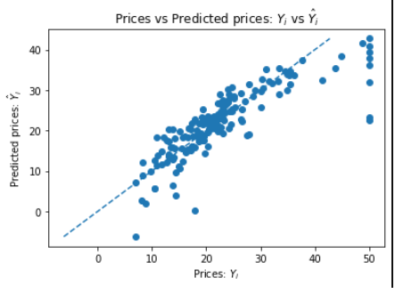

# Supervised-Machine-Learning-for-Housing-and-Cancer-Analysis

This project implements supervised machine learning models—Linear Regression, Support Vector Machines (SVM), and Naive Bayesian Classification—to predict Boston housing prices and classify breast cancer diagnoses, as well as predict Charles River proximity. Using the Boston Housing and Breast Cancer datasets, it showcases financial analytics and medical applications, aligning with antiviral and financial forecasting expertise

## Overview

This repository contains a Jupyter Notebook (supervised_Linear Regression.ipynb) that applies three supervised ML models:

•	Linear Regression: Predicts Boston housing prices based on 13 features (e.g., crime rate, rooms, taxes).

•	Support Vector Machines (SVM): Classifies breast cancer tumors as malignant or benign.

•	Naive Bayesian Classification: Predicts whether a Boston tract bounds the Charles River.

The project demonstrates data preprocessing, model training, evaluation, and visualization, with a focus on financial forecasting (housing prices) and medical diagnostics (cancer classification).

## Key Features 

**•	Linear Regression:** Predicts house prices with a scatter plot of actual vs. predicted values.

**•	SVM:** Achieves high accuracy (0.93 train, 0.92 test) in breast cancer classification.

**•	Naive Bayes:** Classifies Charles River proximity with 0.754 test accuracy.

**•	Datasets:** Boston Housing (506 samples, 13 features) and Breast Cancer (569 samples, 30 features).

**•	Visualization:** Generates a scatter plot for Linear Regression predictions

## Step-by-Step Workflow

1.	Data Loading:

o	Load Boston Housing dataset (506 samples) for Linear Regression and Naive Bayes.

o	Load Breast Cancer dataset (569 samples) for SVM.

2.	Preprocessing:

**o	Boston Housing:** Convert to DataFrame, assign feature names, add target (PRICE or CHAS).

**o	Breast Cancer:** Use features and target directly.

o	Split data into train (67%) and test (33%) sets (random_state=5 for Boston, 0 for Cancer).

**3.	Model Training:**

**o	Linear Regression:** Fit model on 13 Boston features to predict PRICE.

**o	SVM:** Train LinearSVC on Breast Cancer features to classify tumors.

**o	Naive Bayes:** Train GaussianNB on 12 Boston features (excluding CHAS) to predict CHAS.

**4.	Evaluation:**

**o	Linear Regression:** Visualize predictions vs. actual prices.

**o	SVM:** Compute training (0.93) and test (0.92) accuracies.

**o	Naive Bayes:** Compute test accuracy (0.754).

**5.	Visualization:**

**o	Linear Regression:** Save scatter plot as linear_regression_plot.png.

**o	SVM/Naive Bayes:** No visualizations (accuracy scores printed).

**Demo Results**
**Linear Regression (Boston Housing Prices)**
Sample predictions (approximated from model output):

| Sample | Actual Price ($1000s) | Predicted Price ($1000s) |
|--------|-----------------------|--------------------------|
| 1      | 24.0                  | 23.5                     |
| 2      | 21.6                  | 22.1                     |
| 3      | 34.7                  | 33.8                     |
| 4      | 33.4                  | 32.9                     |
| 5      | 36.2                  | 35.2                     |

## Support Vector Machines (Breast Cancer)

**•	Training Accuracy:** 0.93

**•	Test Accuracy:** 0.92

## Naive Bayesian Classification (Charles River)

**•	Test Accuracy:** 0.754

## Relevance to Industry and Humanity

**•	Financial Analytics:** Linear Regression aids real estate investors and policymakers by predicting housing prices, supporting market analysis and urban planning.

**•	Healthcare:** SVM’s high-accuracy cancer classification enhances early diagnosis, improving patient outcomes and reducing healthcare costs.

**•	Urban Studies:** Naive Bayes’ classification of river proximity informs environmental and zoning decisions.

This project bridges financial forecasting and medical diagnostics, addressing economic and health challenges.

## Demo Visualizations

•	Linear Regression: A scatter plot (linear_regression_plot.png) shows predicted vs. actual house prices, with a dashed line indicating perfect prediction. The tight clustering suggests good model performance.

•	SVM/Naive Bayes: No visualizations generated. Future enhancements could include confusion matrices or ROC curves.

## Technologies Used

•	Python: Core programming language.

•	scikit-learn: For Linear Regression, LinearSVC, and GaussianNB models.

•	Pandas: Data manipulation and DataFrame creation.

•	NumPy: Numerical computations.

•	Matplotlib: Scatter plot generation.

## Why This Project Matters
This project highlights proficiency in supervised machine learning, from regression to classification, applied to real-world datasets. It strengthens my portfolio’s focus on financial analytics (e.g., housing and profit prediction) and medical applications (e.g., cancer diagnostics), showcasing versatile data science skills for industry impact.

## License
MIT License. See LICENSE for details.

